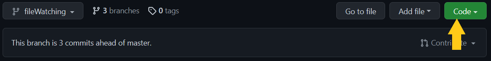
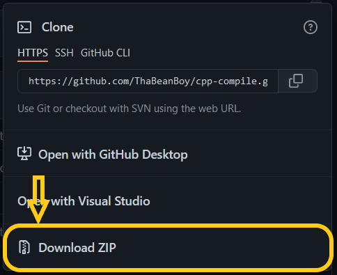

# CPP-COMP

## <u> Vision </u>

This is a command line inteface that helps me with my cpp projects. It runs on node js that helps compile all cpp files into an execution file. it can be configured, through a config.json file or through cli arguments. Good luck with c++ lad, hope you survive.

## <u> Prerequisite </u>

1. The backbone of this cli is [Node JS](https://nodejs.org/en/), <span style="color: red">without it, this cli will not work</span>. here's a link to download node js, [download Node JS](https://nodejs.org/en/download/)
2. Another thing you'll needm is to [NPM](https://www.npmjs.com/). You could say, this allows you to install the cli globally, that way, you can just use **cpp-comp** in any directory. you don't have to download npm, it comes with node js fam.

## <u> Installation </u>

There are 2 ways of installing this cli, honestly, it isn't on npm right now, so I guess I'll have to make you do manual labor, sorry :(. <br>

- <u>Manual way:</u> <br>
  So, first download the this repo, by
  1.  
  2.  
  3.  Unzip the zip folder
  4.  go into the unziped folder
  5.  type the following in the command line
  ```sh
     npm install -g .
  ```

## <u> Basics Compilation</u>

So at the most basic level, this cli will take all .cpp files that it finds in a source folder, compiles them down to .o files, then the linker will do finish up the process and an execution file will be made. lets compile a basic .cpp project.

to compile, input the following in the cli <br>
<span style="color:red"> don't worry if you have an empty prject file, <u>**cpp-comp**</u> will auto-generate a source directory and a main.cpp file </span>

```sh
cpp-comp
```

If you really want to know, here's the compilation process (**NB**: this is a very dumbed down explanation):

1. Take all .cpp files, and compile down to .o files
2. Take all the .o files and link them to build the .exe file
3. Enjoy the .exe you just made

Usually, auto generated main.cpp file will look like this

```cpp
#include <iostream>
using namespace std;

int main() {
	cout << "Hello world" << endl;
	return 0;
}

// Auto generated file.
```

## <u> File Watching </u>

In order to watch files, you can do it one of the folowing ways

- in the CLI:

```
$ cpp-comp -w
```

or

```
$ cpp-comp --watch
```

- in the compile.config.json

```json
{
    ...
    "watch": true,
    ...
}
```
